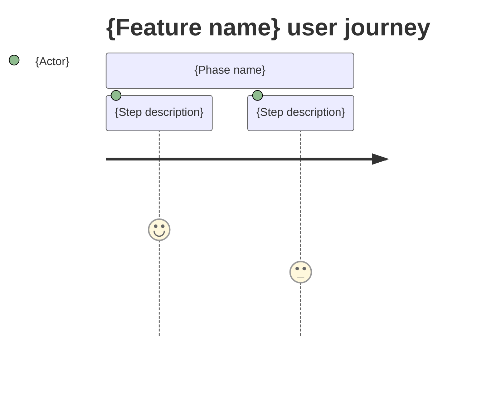

<!-- LARGE OUTPUT NOTE: if this file exceeds 400 lines, signal to orchestrator for chunked review -->

# Screens — {F###_NAME}

## Screen List

{For background-only features with no UI, replace this section with:
`N/A — background feature; no user-facing screens.`}

| Screen Name | What User Sees | What User Can Do |
|-------------|----------------|------------------|
| {ScreenName} | {plain description of page content} | {actions available to the user} |
| {ScreenName} | {plain description of page content} | {actions available to the user} |

## User Journey

{Numbered steps in plain language. Reference screen names from the table above.
Do NOT reference routes, endpoints, or component names.}

1. User arrives at {Screen Name} and sees {content description}.
2. User {action} — {what changes or what they see next}.
3. User is taken to {Screen Name} where {outcome}.

{Optional Mermaid journey diagram:}

