# Upsale Skill — Pipeline Flow

Mermaid visualization of the current `/tkm:upsale` pipeline. Derived from
`SKILL.md` + `references/orchestrator-protocol.md`. See those for the
authoritative spec and per-step procedures.

## Pipeline

```mermaid
flowchart TD
    Start(["/tkm:upsale invoked (CWD)<br/>Preflight: project? PII? injection?"])

    subgraph PhaseA["PHASE A — Repo classification (parallel)"]
        direction TB
        S1["Step 1 — SDD detection<br/>script · detect_sdd.py<br/><i>skipped under --technical-only</i><br/><i>--spec-folder &lt;path&gt; → verify + force isSDD=true</i>"]
        S2["Step 2 — use-context classifier<br/>researcher × 1"]
        SS["Step S — scout discovery<br/>orchestrator + /tkm:scan-codebase<br/>parallel Explore agents"]
        SDD[("sdd-detection.json")]
        UC[("use-context.json")]
        SR[("scout-report.md")]
        S1 --> SDD
        S2 --> UC
        SS --> SR
    end

    Start --> S1
    Start --> S2
    Start --> SS

    isSDD{"isSDD == true ?"}
    SDD --> isSDD

    subgraph PhaseBDisc["PHASE B-discovery — per-item fan-out (researcher × ≤10 batched)"]
        direction LR
        BizDisc["3.1.01–3.1.09 — biz discovery (9 items)<br/>product-identity · target-users · value-prop<br/>features · journeys · monetization · metrics<br/>compliance · known-gaps"]
        TechDisc["4.1.01–4.1.08 — tech discovery (8 items)<br/>repo-identity · tech-stack · architecture<br/>delivery-ops · scale · security · product-surface<br/>platform-support"]
        BizDiscOut[("business/01-discovery/&lt;NN&gt;-&lt;slug&gt;.md")]
        TechDiscOut[("technical/01-discovery/&lt;NN&gt;-&lt;slug&gt;.md")]
        BizDisc --> BizDiscOut
        TechDisc --> TechDiscOut
    end

    isSDD -- yes --> BizDisc
    UC --> BizDisc
    UC --> TechDisc
    SR --> BizDisc
    SR --> TechDisc

    subgraph PhaseBRes["PHASE B-research — biz only · two waves (researcher × ≤10)"]
        direction TB
        Wave1["3.2.01–3.2.05 — wave 1 (5 parallel)<br/>market · competitor · personas<br/>regulatory · pricing-packaging"]
        Wave2["3.2.06 — wave 2<br/>gap-summary (blocked by all wave-1)"]
        ResOut[("business/02-research/&lt;NN&gt;-&lt;slug&gt;.md")]
        Wave1 --> Wave2 --> ResOut
    end

    BizDiscOut --> Wave1
    SR --> Wave1

    subgraph PhaseBImp["PHASE B-improvement — per-aspect fan-out (researcher × ≤10 globally)"]
        direction LR
        BizImp["3.3.01–3.3.12 — biz improvement (12 items)<br/>spec-alignment · feature-coverage · ux-gaps<br/>conversion · time-to-market · competitive · compliance<br/>growth · pricing · analytics · support · new-features"]
        TechImp["4.2.01–4.2.14 — tech improvement (14 items)<br/>architecture · code-quality · tests · ci-cd · perf<br/>security · observability · docs-dx · error-handling<br/>scalability · accessibility · new-features<br/>ecosystem-parity · platform-parity"]
        BizImpOut[("business/03-improvement/&lt;NN&gt;-&lt;slug&gt;.md")]
        TechImpOut[("technical/02-improvement/&lt;NN&gt;-&lt;slug&gt;.md")]
        BizImp --> BizImpOut
        TechImp --> TechImpOut
    end

    ResOut --> BizImp
    TechDiscOut --> TechImp

    subgraph PhaseBProp["PHASE B-track-proposal — per active track (researcher × 1–2)"]
        direction LR
        BizProp["3.4 — business-proposal<br/>researcher · per-track cap ≤30"]
        TechProp["4.3 — technical-proposal<br/>researcher · per-track cap ≤30"]
        BizPropOut[("business/04-business-proposal.md")]
        TechPropOut[("technical/03-technical-proposal.md")]
        BizProp --> BizPropOut
        TechProp --> TechPropOut
    end

    BizImpOut --> BizProp
    TechImpOut --> TechProp

    subgraph PhaseC["PHASE C — combine + dedup (sequential)"]
        direction TB
        S5a["Step 5a — combine<br/>script · combine_proposals.py"]
        Combined[("combined-initial.md<br/>marker: &lt;!-- dedup: pending --&gt;")]
        S5b["Step 5b — dedup + reclassify<br/>reviewer · single agent · full-scope<br/>intra-aspect + cross-aspect intra-track + cross-track"]
        CombinedFinal[("combined-initial.md<br/>marker: &lt;!-- dedup: applied (n=N) --&gt;")]
        S5a --> Combined --> S5b --> CombinedFinal
    end

    BizPropOut --> S5a
    TechPropOut --> S5a

    subgraph PhaseCPrep["PHASE C-prep — Phase-D payload extraction (sequential)"]
        direction TB
        S5c["Step 5c — phase-d-prep<br/>script · phase_d_prep.py<br/>reads combined + improvement dirs + discovery dirs"]
        Manifest[("validation/_payloads/<br/>  item-&lt;NN&gt;-&lt;slug&gt;.json × N<br/>  _manifest.json (atomic completion)")]
        S5c --> Manifest
    end

    CombinedFinal --> S5c

    subgraph PhaseD["PHASE D — validate (parallel · reviewer × N · batched ≤10)"]
        direction TB
        S6["Step 6.&lt;NN&gt;-&lt;slug&gt; — validator (one per item)<br/>reviewer · Read(payload_path) → holistic gate<br/>fail → DROP; pass → checks 2–6 → KEEP / REVISE / DROP"]
        Verdicts[("validation/item-&lt;NN&gt;-&lt;slug&gt;.md × N")]
        S6 --> Verdicts
    end

    Manifest --> S6

    subgraph PhaseE["PHASE E — apply verdicts (sequential)"]
        direction TB
        S7["Step 7 — apply<br/>script · apply_verdicts.py<br/>KEEP carry-over · REVISE rewrite (else KEEP+warn)<br/>DROP remove · slug-mismatch → KEEP+warn<br/>rollup recompute + value/effort sort within aspect"]
        Final[("upsale-proposal.md<br/>customer-ready")]
        S7 --> Final
    end

    Verdicts --> S7

    Trailer(["Response trailer<br/>skip:/done: log lines · use-context · scout<br/>cap: · dedup: · reclassify: · revise: · drop: · warn:<br/>Saved: &lt;abs path&gt;<br/>Status: DONE | DONE_WITH_CONCERNS — &lt;reason&gt;"])
    Final --> Trailer

    classDef script fill:#e1f5e1,stroke:#2e7d2e,color:#000
    classDef researcher fill:#e1e8f5,stroke:#2e3e7d,color:#000
    classDef reviewer fill:#f5e1e1,stroke:#7d2e2e,color:#000
    classDef orch fill:#f5f0e1,stroke:#7d6e2e,color:#000
    classDef artifact fill:#fafafa,stroke:#888,color:#000,stroke-dasharray:3 3
    classDef gate fill:#fff,stroke:#000,color:#000

    class S1,S5a,S5c,S7 script
    class S2,BizDisc,TechDisc,Wave1,Wave2,BizImp,TechImp,BizProp,TechProp researcher
    class S5b,S6 reviewer
    class SS orch
    class SDD,UC,SR,BizDiscOut,TechDiscOut,ResOut,BizImpOut,TechImpOut,BizPropOut,TechPropOut,Combined,CombinedFinal,Manifest,Verdicts,Final artifact
    class isSDD gate
```



### Legend

| Style              | Actor                                                                 |
|--------------------|-----------------------------------------------------------------------|
| Green box          | **Bash/Python script** — deterministic, no LLM                        |
| Blue box           | **researcher** subagent                                               |
| Red box            | **reviewer** subagent                                                 |
| Yellow box         | **orchestrator** action (composes `/tkm:scan-codebase`, holds `Agent`)|
| Dashed grey box    | Artifact written to `plans/upsale/`                                   |
| Diamond            | Gating decision (use-context, isSDD)                                  |

## Cross-cutting rules

- **Idempotency** — each step skips when its output exists & is non-empty. Exception: Step 5b uses marker-based gating (`<!-- dedup: pending -->` ⇒ run; `<!-- dedup: applied (n=…) -->` ⇒ skip) because it rewrites the same path as 5a.
- **Step inputs (same track)** — each step reads ONLY its previous step's artifact plus the cross-cutting inputs:
  - `use-context.json` (gates every step)
  - `scout-report.md` (discovery 3.1.NN / 4.1.NN + research 3.2.NN)
  - `01-discovery/` directory union (research 3.2.NN, tech improvement 4.2.NN)
  - `02-research/` directory union (biz improvement 3.3.NN)
  - `03-improvement/` directory union (biz track proposal 3.4)
  - `02-improvement/` directory union (tech track proposal 4.3)
  - `04-business-proposal.md` + `03-technical-proposal.md` (combine 5a)
- **Force regen** — delete the artifact at the desired step (or pass `--force` to wipe the whole `plans/upsale/` tree). When deleting `combined-initial.md`, ALSO delete the entire `validation/` tree (incl. `_payloads/`) — verdicts are keyed by item index and a regenerated combined with reordered items would silently mis-apply stale verdicts.
- **Gating** — `use-context` (`internal | hybrid | customer-facing`) is applied per-aspect during fan-out via the line-2 `**Use context:**` marker on every per-item file. Subagents NEVER re-read `use-context.json`.
- **Track gating** — default = technical always, business only when `isSDD == true`. `--technical-only` skips Step 1 + all `3.*` steps. `--business-only` requires `isSDD == true` (BLOCKED otherwise) and skips all `4.*` steps. `--spec-folder <path>` short-circuits Step 1's auto-detection: the script verifies the folder is real (exists, ≥1 `*.md`, repo-relative) and writes `isSDD: true`; verification failure halts the pipeline (no `isSDD:false` fallback).

## TaskList integration

Each step is wrapped in `TaskCreate({subject, description, addBlockedBy})` so the dep graph is explicit and observable via `TaskList`. Subjects use the `upsale: ` prefix for filterability. Dependency graph follows the diagram arrows:

```
T1, T2, TS            : no blockers
T3.1.NN               ⇐ T1, T2, TS
T4.1.NN               ⇐ T2, TS
T3.2.01..05 (wave 1)  ⇐ all T3.1.*
T3.2.06     (wave 2)  ⇐ all T3.1.* + T3.2.01..05
T3.3.NN               ⇐ all T3.2.*
T4.2.NN               ⇐ all T4.1.*
T3.4                  ⇐ all T3.3.*
T4.3                  ⇐ all T4.2.*
T5a                   ⇐ active-track proposal task(s) — T3.4 and/or T4.3
T5b                   ⇐ T5a
T5c                   ⇐ T5b
T6.<NN>-<slug>        ⇐ T5c (one per item in manifest, ≤10 concurrent globally)
T7                    ⇐ every T6.<NN>-<slug>
```

**Reconcile preflight** runs first on every invocation — closes any in-progress `upsale: *` task whose declared output is already on disk. Steps 5b/5c/6 use override conditions (marker check, sha256 match, manifest membership) because plain existence is insufficient. Full table in `references/orchestrator-protocol.md` → Reconcile preflight.

**Terminal step closure** — Step 7 is a script; the orchestrator marks `T7` completed after the script exits 0 (no subagent self-close).

## Degradation paths

```
Step 1 BLOCKED   → script self-writes {isSDD:false} fallback → tech-only flow
Step 2 BLOCKED   → fallback {useContext:"hybrid", confidence:"low"}
Step S BLOCKED   → /tkm:scan-codebase unavailable → Bash find fallback walk
                   ([SCOUT_FALLBACK] noted in scout-report ## Notes);
                   if that also fails → placeholder scout-report
                   ([SCOUT_BLOCKED] noted) → tracks fall back to direct grep
Item BLOCKED     → continue rest of batch; downstream phase notes missing
                   items and proceeds with partial directory union
All items BLK    → escalate → BLOCKED: all <discovery|research|aspects>
                   missing for <track>
Wave 1 fully BLK → skip wave 2 (gap-summary) + biz improvement + biz proposal
Track BLOCKED    → Phase C still runs if at least one active track exists;
                   absent track's section omitted from combined-initial.md;
                   under --*-only, blocked active track escalates to BLOCKED
Both empty       → 5c writes empty manifest → skip Phase D → 7 writes minimal
                   proposal with ⚠️ no-items banner
5b BLK           → marker stays `pending` → 5c BLOCKED (cannot proceed)
5c BLK           → propagates to user; Phase D will NOT proceed without the
                   manifest (no inline fallback)
Validator BLK    → missing verdict → Step 7 KEEPs + ⚠ banner counts unvalidated
```
